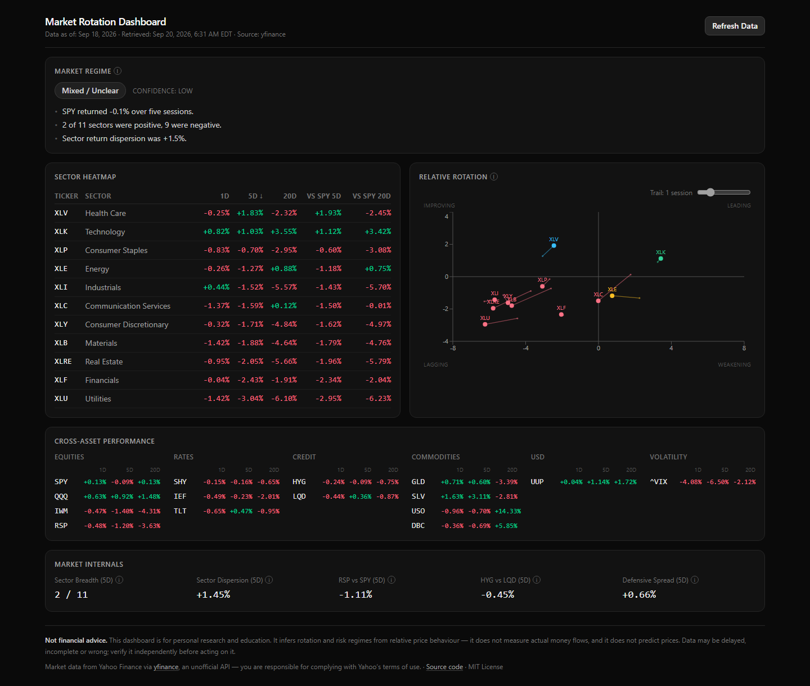

# Market Rotation Dashboard

A personal, open-source dashboard that helps answer:

> Is the market experiencing normal rotation between equity sectors, or is
> there evidence of a broader movement away from equities into defensive or
> alternative assets?



## What it does

- Tracks U.S. sector ETFs, broad equity benchmarks, bonds/credit, gold and
  commodities, the U.S. dollar, volatility, and market-breadth proxies.
- Calculates 1D/5D/20D returns, relative strength vs SPY, sector breadth and
  dispersion, RSP/SPY, HYG/LQD, and a defensive/cyclical spread.
- Classifies the current market regime (`BROAD_RISK_ON`,
  `INTERNAL_ROTATION`, `DEFENSIVE_ROTATION`, `BROAD_RISK_OFF`, `MIXED`) using
  a deterministic, rule-based engine and shows exactly why that regime was
  chosen.

## What it does NOT do

- No brokerage integration, trade execution, accounts, or portfolio tracking.
- No AI/LLM-based analysis or predictions — the regime engine is fixed rules.
- No real ETF fund-flow data (price-based rotation only). See
  [docs/data-methodology.md](docs/data-methodology.md).
- No alerts, notifications, or multi-user infrastructure.

## Architecture

```text
React (TS) client → FastAPI → MarketService / MetricsService / RegimeService
                                   │
                             MarketDataProvider (interface)
                                   │
                          YFinanceMarketDataProvider
                                   │
                                DuckDB (local cache)
```

`yfinance` is one interchangeable adapter behind `MarketDataProvider`; the
frontend and business logic never call it directly. See
[docs/architecture.md](docs/architecture.md).

## Data source

Prices: [`yfinance`](https://pypi.org/project/yfinance/) (Yahoo Finance,
unofficial). No API key required.

Sector fund flows: State Street's published NAV history for the eleven Select
Sector SPDRs. Daily net flow is the day-over-day change in shares outstanding
priced at that day's NAV. ETF shares are created and redeemed only by
authorized participants, so this is measured creation/redemption activity
rather than a price-based estimate. Print the current table with:

```bash
cd backend && uv run python scripts/spdr_flows_report.py
```

Both sources are cached locally in DuckDB and refreshed on demand — see
[Refresh behavior](docs/data-methodology.md). Stop the backend first: DuckDB
allows one writer, so the report cannot open the cache while the API holds it.

A [weekly canary](.github/workflows/spdr-canary.yml) fails if State Street
moves or reshapes those files. No fund data is redistributed from this
repository.

## Local setup

Requirements: Python 3.12+, Node 20+, [`uv`](https://docs.astral.sh/uv/).

```bash
# Backend — runs on http://localhost:8000
cd backend
uv sync
uv run uvicorn app.main:app --reload   # or, from the repo root: npm run dev:backend

# Frontend (separate terminal) — runs on http://localhost:5173
cd frontend
npm install
npm run dev                            # or, from the repo root: npm run dev:frontend
```

Open http://localhost:5173. The database starts empty, so the first backend
start downloads ~400 days of history for the tracked universe — give it a few
seconds before the regime and metrics appear. After that, startup only fetches
the sessions it is missing. **Refresh Data** (or
`curl -X POST http://localhost:8000/api/data/refresh`) forces an update at any
time, rate-limited to one call per 60 seconds. No credentials are required at
any step.

## Development commands

```bash
# backend
cd backend
uv run ruff check .
uv run pytest --cov=app --cov-report=term-missing

# frontend — same sequence CI runs
cd frontend
npm run format         # prettier --check
npm run lint
npm run type-check
npm run test:coverage  # fails under 80% coverage
npm run build
```

## Testing

Backend calculation and regime-classification tests run against synthetic
fixtures (`backend/tests/fixtures/`) — never against live Yahoo data, so
results are deterministic in CI.

## Methodology summary

The dashboard infers rotation/risk regimes from **relative price behavior**
(returns, relative strength, breadth, dispersion). It does not measure actual
money flows — that requires ETF creation/redemption data, which is out of
scope for this version. See [docs/data-methodology.md](docs/data-methodology.md)
for every formula used.

## Disclaimer

This project is for personal research and education. It is not investment
advice. Market data is provided by Yahoo Finance via `yfinance`; you are
responsible for complying with Yahoo's terms of use for that data. Data may
be delayed, incomplete, or wrong — verify independently before acting on it.

## License

[MIT](LICENSE)
